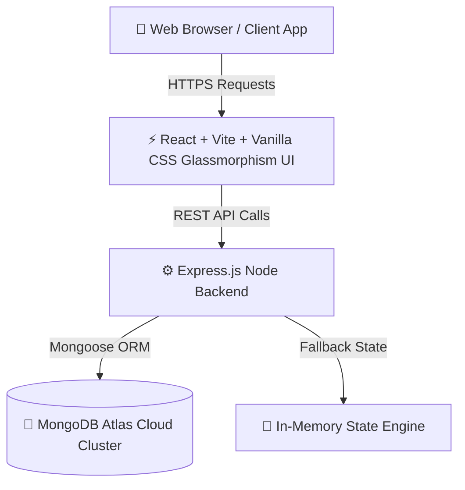

# 🎓 EDU-PAY — Institutional College Fee Management & Financial Portal

[](https://edu-pay-1.onrender.com)
[](https://mani6301361169.github.io/EDU-PAY/)
[](https://nodejs.org/)
[](LICENSE)

**EDU-PAY** is a state-of-the-art full-stack institutional financial automation platform designed to digitize college fee collection, departmental revenue tracking, payment verification, student registration, and parent financial monitoring.

---

## 🌟 Key Features

### 👨‍🎓 1. Student Financial Portal
- **Real-Time Dues & Prescribed Fee Breakdown**: Dynamic calculation of College, Tuition, Hostel, Bus, Exam, and Contingency fees.
- **Instant Payment Gateway Integration**: Multi-mode online fee settlement with instant digital receipt generation.
- **Payment History & Receipts**: Historical transaction log with downloadable official PDF & image payment receipts.

### 👪 2. Parent Financial Portal
- **Automated Student-Parent Data Linking**: Zero hardcoded strings. Automatically links parents to registered students via roll number, email, or father's name.
- **Registered Parent/Guardian View**: Dynamically displays the registered Father's Name entered during student registration.
- **Child Academic & Financial Overview**: Single-window monitoring of academic attendance, total billed fees, paid amounts, and outstanding balances.

### 🛡️ 3. Admin Control Center
- **System-Wide Financial Analytics**: Real-time stats on total enrolled students, total billed revenue, verified collections, and outstanding dues.
- **Departmental Revenue Recovery Ledger**: Automated grouping of revenue metrics by department (CSE, ECE, ME, Civil, AI&DS).
- **Registration Approval Flow**: Review public student registrations, provision user accounts, or reject invalid responses.
- **Bulk Excel/CSV Student Import**: Parse CSV/Excel datasets to provision hundreds of student accounts simultaneously.
- **Clean System Reset Controls**: Reset all statistical baselines cleanly to ₹0 without foreign key database crashes.

### 💼 4. Accountant Portal
- **Financial Audit & Collection Logs**: Inspect transaction ledgers, verify offline cash/bank transfers, and filter collections by department or date.

---

## 🏗️ Architecture & Technology Stack



- **Frontend**: React 19, Vite 8, React Router v7, Lucide / Feather Icons, CSS Modules, HTML2Canvas.
- **Backend**: Node.js, Express 4, Mongoose ORM, Helmet (Security Headers), CORS, Bcrypt (Password Hashing).
- **Database**: MongoDB Atlas Cloud Cluster with fallback state engine.
- **Hosting & CI/CD**: Render (Backend), GitHub Pages (Frontend), Automated Node.js Deployment Workflow.

---

## 🚀 Quick Start & Installation

### Prerequisites
- Node.js `v18.0.0` or higher
- npm `v9.0.0` or higher
- MongoDB Atlas URI (optional; fallback in-memory state engine activates automatically if offline)

### 1. Clone the Repository
```bash
git clone https://github.com/Mani6301361169/EDU-PAY.git
cd EDU-PAY
```

### 2. Environment Setup
Copy the example environment configuration:
```bash
cp backend/.env.example backend/.env
```

Configure `backend/.env`:
```env
PORT=5000
NODE_ENV=production
MONGO_URI=mongodb+srv://<username>:<password>@cluster.mongodb.net/edu-pay?retryWrites=true&w=majority
JWT_SECRET=your_super_secret_jwt_key
CLIENT_URL=https://mani6301361169.github.io
```

### 3. Development Commands
Install dependencies and launch services:

```bash
# Install root, backend, and frontend dependencies
npm run build

# Start backend server locally
cd backend
npm start

# Start frontend dev server in separate terminal
cd frontend
npm run dev
```

---

## ⚙️ Automated Daily Git & Deployment Workflow

EDU-PAY features an automated Node.js workflow script (`scripts/auto_commit_deploy.js`) that automatically validates, commits, pushes, and deploys project changes while your workstation is active:

1. **Pre-Commit Lint & Build Verification**: Executes `oxlint` and `vite build` to guarantee zero broken builds reach production.
2. **Conventional Commit Formatting**: Analyzes file modifications and formats structured commit messages (`feat(portal)`, `style(ui)`, `docs`, etc.).
3. **GitHub Push with Retries**: Pushes to `main` branch with exponential backoff retries for network resilience.
4. **Automatic Render & GitHub Pages Sync**: Pushing to `main` automatically triggers Render webhooks and updates GitHub Pages.

To execute manually at any time:
```bash
node scripts/auto_commit_deploy.js
```

---

## 🌐 Production Endpoints

- **Live Frontend App**: [https://mani6301361169.github.io/EDU-PAY/](https://mani6301361169.github.io/EDU-PAY/)
- **Live Backend API**: [https://edu-pay-1.onrender.com](https://edu-pay-1.onrender.com)
- **GitHub Repository**: [https://github.com/Mani6301361169/EDU-PAY.git](https://github.com/Mani6301361169/EDU-PAY.git)

---

## 📄 License

Distributed under the **MIT License**. See `LICENSE` for more information.
